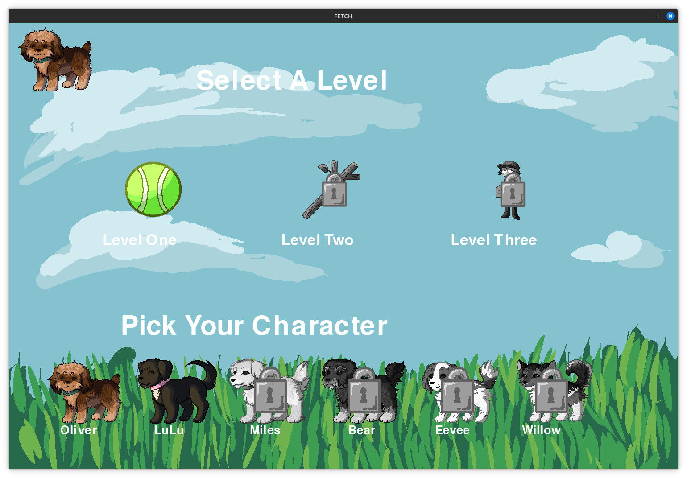
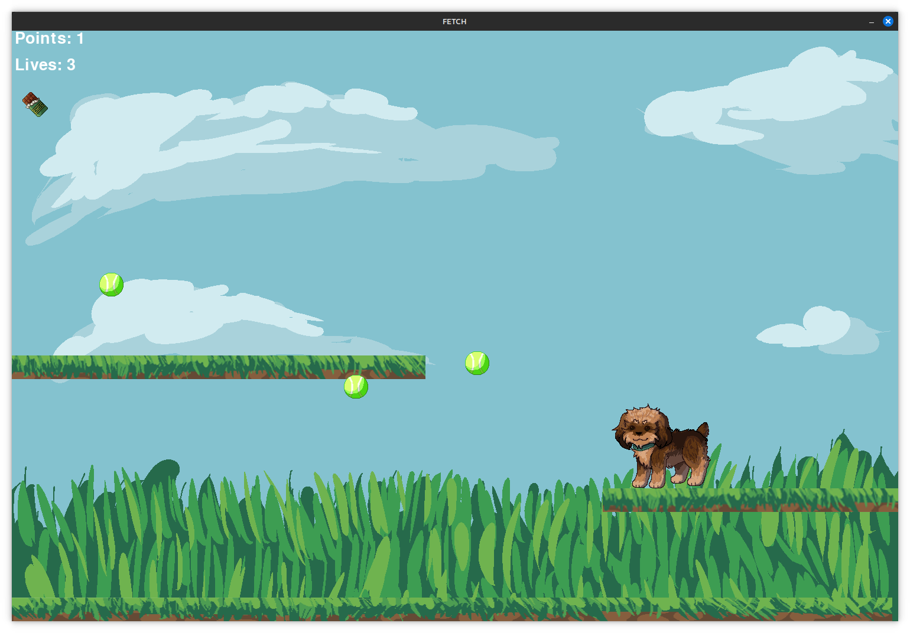

# Fetch



## How to Download

Click the green "<> Code" button up top and select "Download as ZIP".

It can also be downloaded via *git*:

```
git clone https://github.com/gemadden/Fetch.git
```

## Requirements

**Fetch** can be played on Windows, macOS, and Linux. *Python 3* and *PyGame* are required.

To install *PyGame*, run the following from the terminal:

```
pip install pygame
```

If *Python* is not available on your system, a Windows executable, *fetch.exe*, is also available. Run the executable to play the game.

## How to Play

From the terminal, run the following:

```
python3 title_screen.py
```

From the title screen, select which dog you would like to play as and then select level 1.

When the game starts, use the arrow keys to control your dog, moving them to collect as many tennis balls as possible. However, be careful to avoid any chocolate bars, as these can hurt you.


